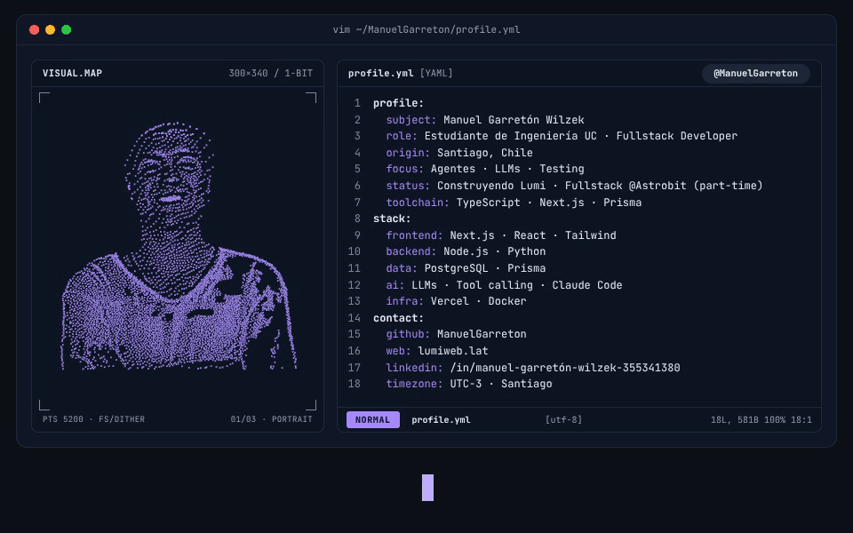

 

## Sobre mí

Estudiante de Ingeniería en la **Pontificia Universidad Católica de Chile**, desarrollador fullstack part-time en **[Astrobit](https://astrobit.cl)**.

- 🤖 Fundador de **[Lumi](https://lumiweb.lat)**, un asistente personal que vive en WhatsApp
- 🌐 Aprendiendo a diseñar sistemas de agentes, LLMs, y testing.
- ♟️ Ajedrez — construí una herramienta de uso personal para analizar mis propias partidas

 

## Experiencia

### [Astrobit](https://astrobit.cl) — Desarrollador fullstack (part-time)

ERP chilena omnicanal para vender en **Mercado Libre, Falabella, Paris, Ripley y Shopify** con **un solo inventario**. Emite automáticamente la boleta o factura al **SII** y muestra el **margen real de cada venta**, después de la comisión del canal.

Trabajo en el producto de punta a punta: desde las integraciones con los marketplaces hasta la interfaz con la que lo usan las tiendas.

 

## Proyectos

### [Lumi](https://lumiweb.lat) — asistente personal en WhatsApp

Un asistente que vive donde ya está la gente: WhatsApp. Notas, pendientes, recordatorios, calendario, finanzas personales, seguimiento de ramos (Canvas) — todo por chat, con un dashboard web para lo que es más cómodo ver en pantalla grande. En producción, con usuarios reales y plan de pago.

Lo más interesante de construirlo fue diseñar el motor de *tool calling*: un enrutador que decide qué herramientas ofrecerle al modelo según el mensaje, una cadena de respaldo entre proveedores de LLM cuando uno se satura, y memoria de largo plazo por usuario.

`TypeScript` · `Next.js` · `Prisma` · `PostgreSQL` · `Groq / LLMs` · `WhatsApp Web API` · `Vercel`

### [Ajedrez](https://ajedrez-silk.vercel.app) — análisis personal de partidas

No es otro entrenador genérico: analiza **mis** partidas de Chess.com con Stockfish, arma un roadmap de estudio por bloques de apertura atado a mis resultados reales, y responde preguntas de teoría con una base de conocimiento propia en vez de improvisar.

`Next.js` · `TypeScript` · `Stockfish (UCI)` · `Prisma`

 

## Stack

  

 

## GitHub

<!--
  Generado por el workflow de Acciones "Metrics" (.github/workflows/metrics.yml,
  lowlighter/metrics) — corre con un token propio que SÍ puede contar la
  actividad de repos privados (nunca expone sus nombres, solo suma al total).
  El SVG se commitea acá mismo, así que carga instantáneo. Se regenera a diario
  (cron) usando el secret METRICS_TOKEN.
-->

  

 

## Contacto

&nbsp;&nbsp;
&nbsp;&nbsp;

  

| Universidad | Astrobit |
| :-: | :-: |
| `magarreton@uc.cl` | `magarreton@astrobit.cl` |

 

Santiago, Chile 🇨🇱

